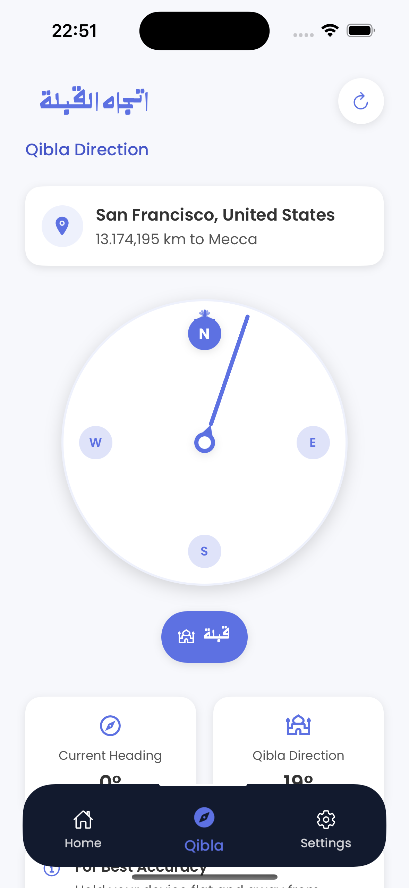
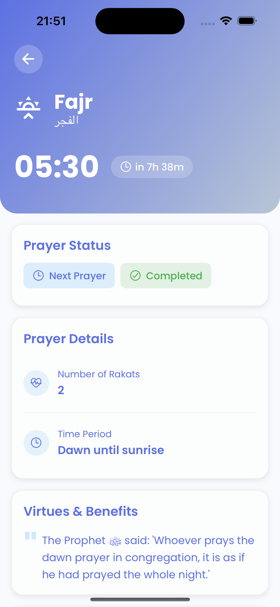
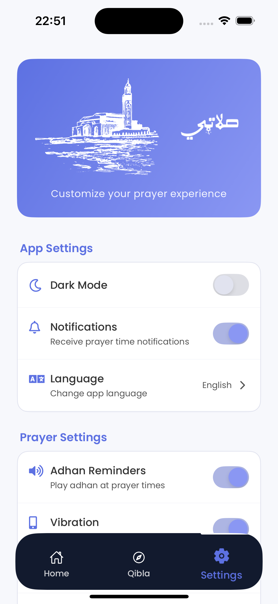
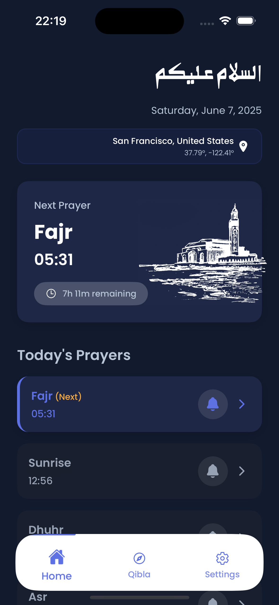
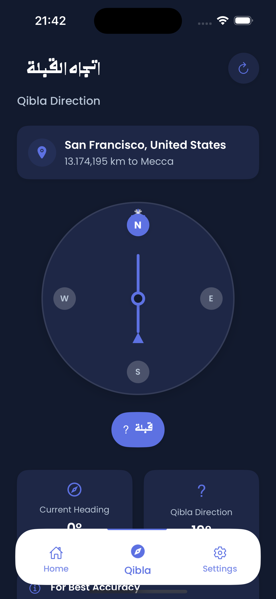
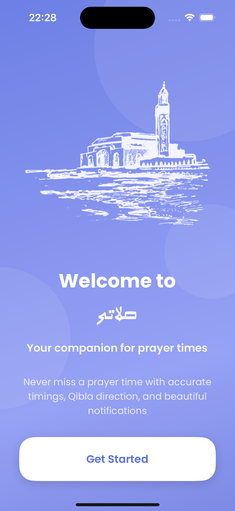

<div align="center">

# 🕌 Salati | صلاتي

### *Your Ultimate Islamic Prayer Companion*

[](https://reactnative.dev/)
[](https://expo.dev/)
[](https://www.typescriptlang.org/)
[](./LICENSE)

*Never miss a prayer time with accurate calculations, beautiful notifications, and Qibla direction.*

[📱 Download](#installation) • [✨ Features](#features) • [🚀 Quick Start](#quick-start) • [📖 Documentation](#documentation)

---

</div>

## 📱 Preview

<div align="center">

### 🌟 App Screenshots

| Home Screen | Qibla Compass | Prayer Details | Settings |
|-------------|---------------|----------------|----------|
|  |  |  |  |

#### Dark Mode Variants
| Home Dark | Qibla Dark | Settings Dark | Welcome Screen |
|-----------|------------|---------------|----------------|
|  |  |  |  |

### 🎥 Demo Video

<details>
<summary>📹 Watch App Demo</summary>

[▶️ Click here to watch the demo video](https://github.com/user-attachments/assets/demovideo.mp4)

*Experience the beautiful interface and smooth animations*

</details>

</div>

---

## ✨ Features

<div align="center">

### 🔥 Core Features

</div>

| 🕐 **Prayer Times** | 🧭 **Qibla Finder** | 🔔 **Smart Notifications** |
|---------------------|---------------------|----------------------------|
| • Accurate calculations based on location<br>• Multiple calculation methods<br>• Real-time updates | • Compass-based direction<br>• Visual Qibla indicator<br>• Distance to Mecca | • Customizable reminders<br>• Adhan notifications<br>• Background scheduling |

| 🌙 **Themes** | 🌍 **Location** | 📱 **Design** |
|---------------|-----------------|---------------|
| • Beautiful dark/light themes<br>• Automatic switching<br>• Custom color schemes | • GPS-based accuracy<br>• Manual location setup<br>• Timezone awareness | • Modern UI/UX<br>• Smooth animations<br>• Responsive design |

---

## 🚀 Quick Start

### Prerequisites

```bash
# Node.js 18+ required
node --version  # Should be 18.0.0 or higher

# Install Expo CLI globally
npm install -g @expo/cli
```

### Installation

<details>
<summary>📦 Step-by-step Installation</summary>

1. **Clone the repository**
   ```bash
   git clone https://github.com/yourusername/salati.git
   cd salati
   ```

2. **Install dependencies**
   ```bash
   npm install
   # or
   yarn install
   ```

3. **Start the development server**
   ```bash
   npx expo start
   ```

</details>

### Building

<details>
<summary>📱 iOS & Android Build</summary>

#### For iOS:
```bash
npx expo run:ios
```

#### For Android:
```bash
npx expo run:android
```

</details>

---

## 📖 Documentation

<details>
<summary>📚 Comprehensive Guide</summary>

- **[Getting Started](./docs/getting-started.md)**
- **[Configuration](./docs/configuration.md)**
- **[API Reference](./docs/api-reference.md)**
- **[Components](./docs/components.md)**
- **[Hooks](./docs/hooks.md)**
- **[Context API](./docs/context-api.md)**

</details>

---

## 🛠️ Development

### Local Development

```bash
# Start the development server
npm run start

# iOS simulator
npm run ios

# Android emulator
npm run android
```

### Testing

```bash
# Run unit tests
npm test

# Run end-to-end tests
npm run e2e
```

---

## 🔧 Troubleshooting

<details>
<summary>❓ Common Issues</summary>

- **App not starting?** Ensure all dependencies are installed and up-to-date.
- **Location issues?** Check device location settings and permissions.
- **Build failures?** Clean the build folder and try rebuilding.

</details>

---

## 🤝 Contributing

Contributions are welcome! Please feel free to submit a Pull Request.

---

## 📜 License

This project is licensed under the MIT License.
